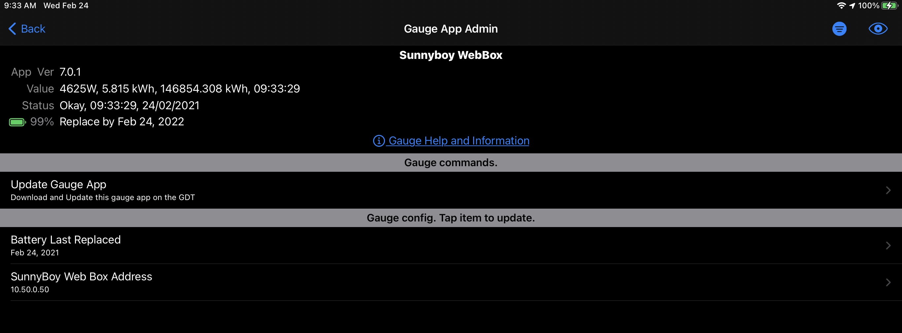
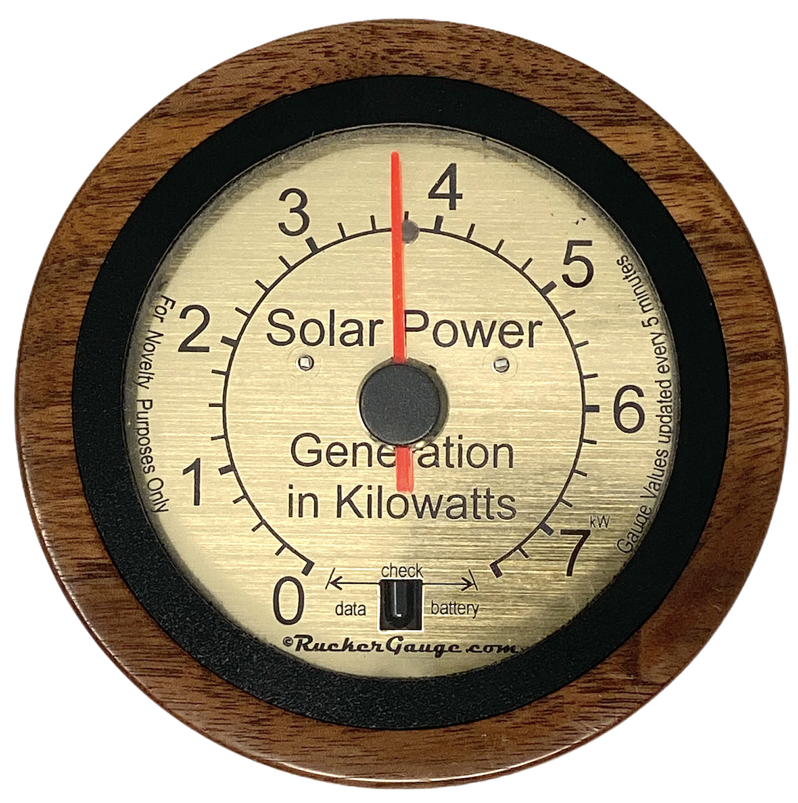
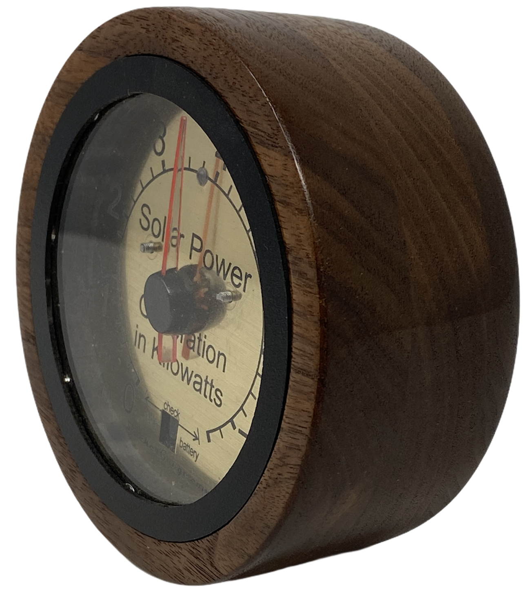

# SunnyBoy Power Gauge App

This WallGauge reads real-time solar production from a local SMA Sunny WebBox via its REST API. The solar production value is then sent to a physical battery powered gauge for display.

[more information on the SunnyBow WebBox](https://www.sma-sunny.com/en/questions-and-answers-on-discontinuation-of-the-sunny-webbox/)

## GDT Administrator notes

The above screen shot is from the WallGauge IOS App [gdtAdministrator](https://apps.apple.com/us/app/gdt-administrator/id1498115113) running on an iPad with this SunnyBoy Power Gauge App installed.

To configure the gauge app you must tap on the “SunnyBoy Web Box Address” list item and enter the IP address of your SunnyBoy WebBox.  In this screen shot the address is 10.50.0.50.

The Value shown at the top of the screen is the the current power being generated, total kilowatt hours for the day, and total kilowatt hours since the array was commissioned.

## Gauge Art

